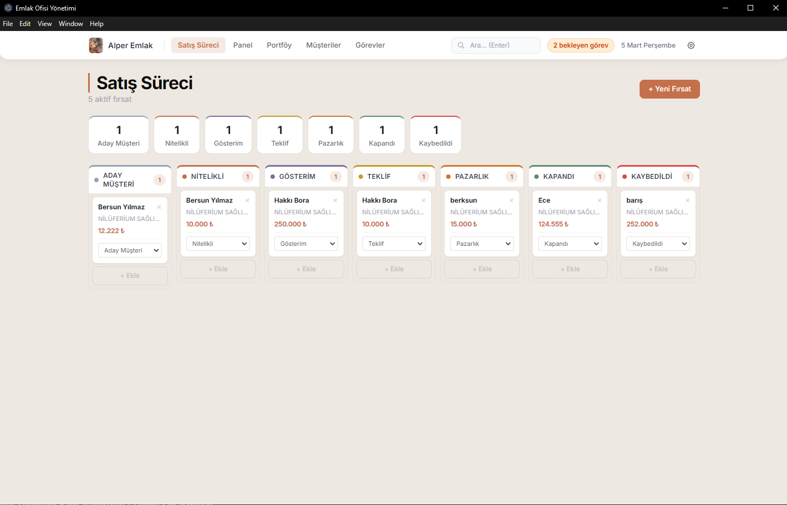
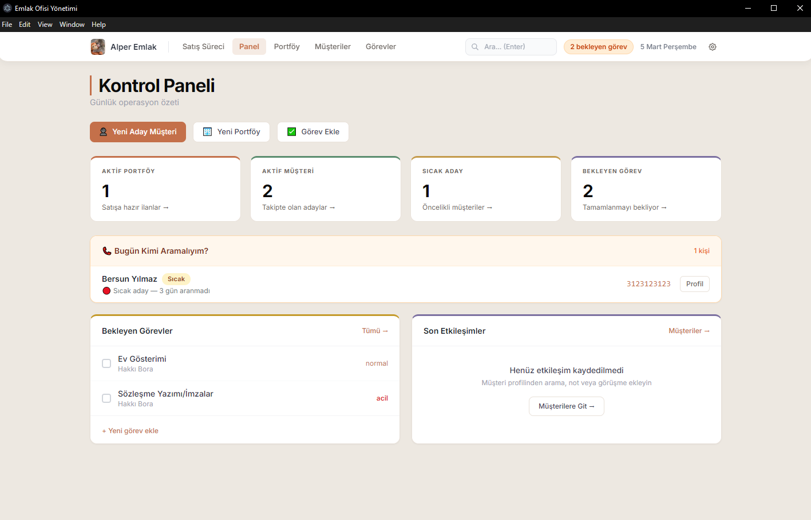
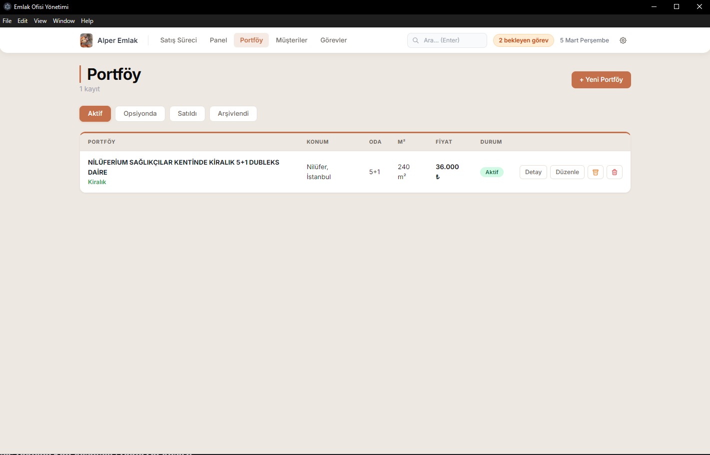
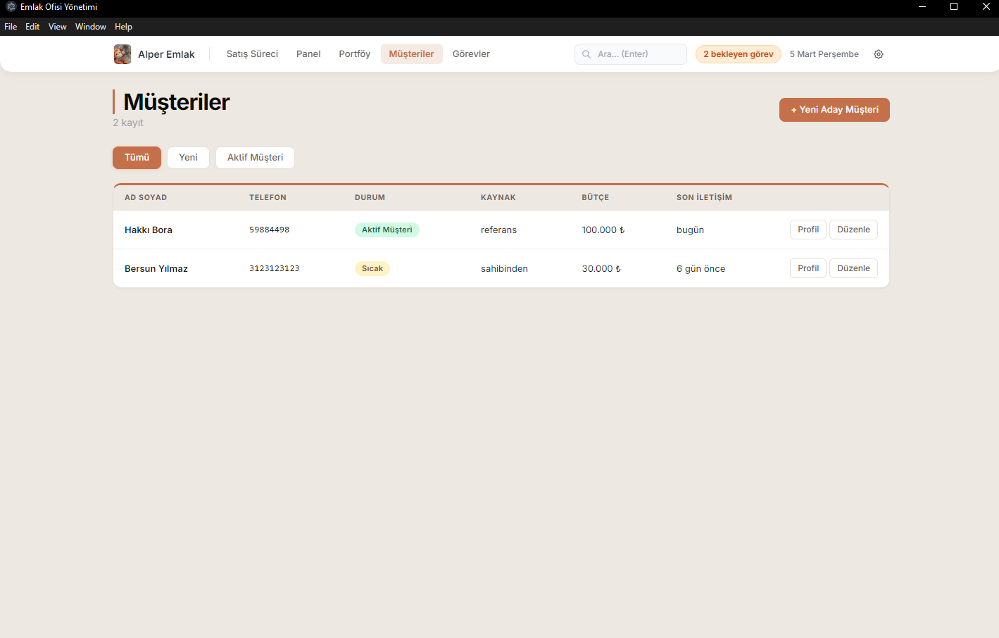
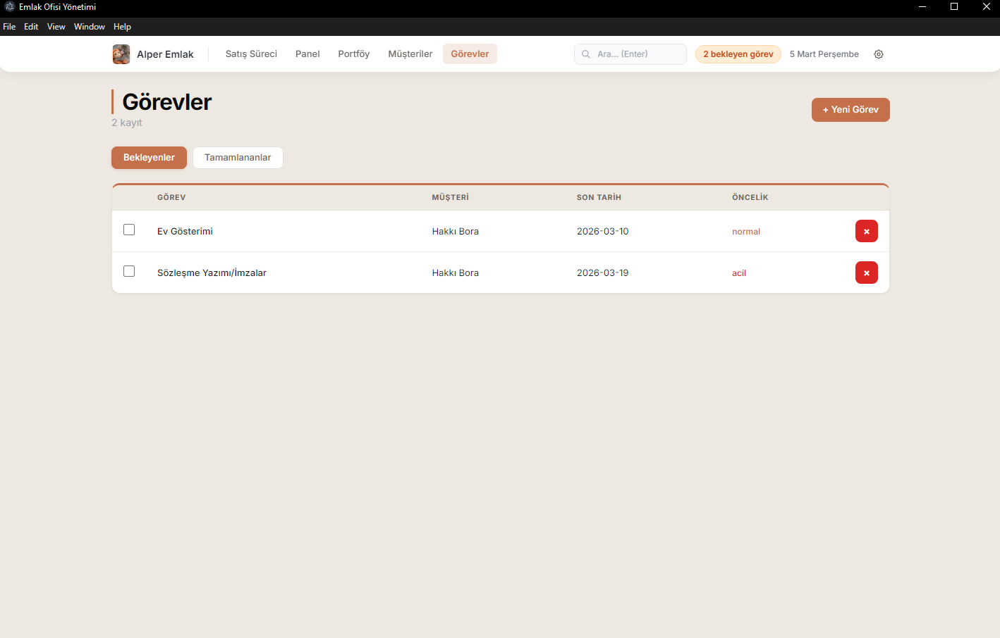
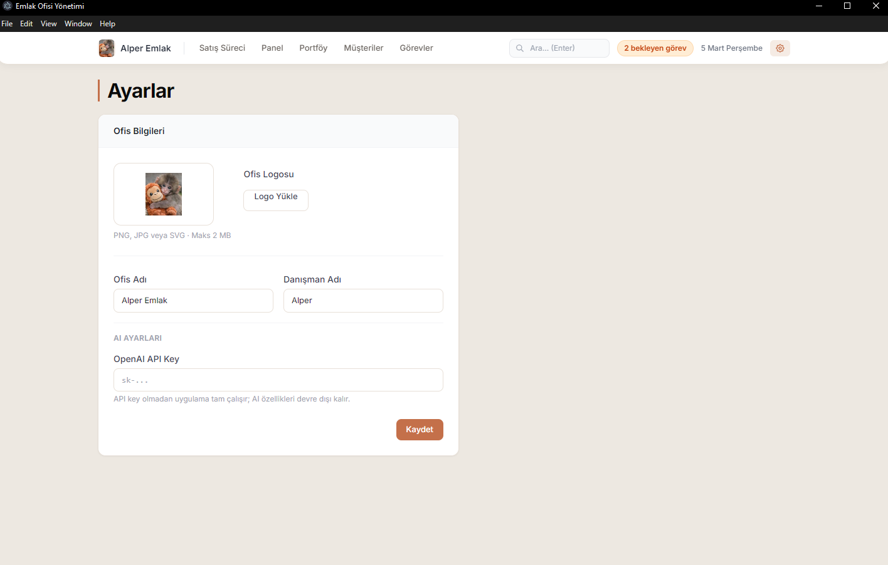

A small CRM-style desktop application built as a personal learning project to experiment with property management workflows.
# Emlak CRM - Personal Learning Project

Basit bir emlak operasyon yönetimi uygulaması.  
Bu proje kişisel bir öğrenme projesi olarak geliştirilmiştir ve temel uygulama geliştirme ile iş akışı yönetimi (workflow) kavramlarını denemek amacıyla yapılmıştır.

Uygulama; emlak portföyü, müşteri takibi ve satış pipeline süreçlerini tek bir panel üzerinden yönetmeyi amaçlar.

---

# Özellikler

## Pipeline Yönetimi
Satış sürecini aşamalar halinde takip etmeyi sağlar.

- Lead
- Nitelikli
- Gösterim
- Teklif
- Pazarlık
- Kapandı

## Dashboard

Günlük operasyonların hızlı özetini gösterir.

- aktif portföy sayısı
- aktif müşteri sayısı
- sıcak lead sayısı
- bekleyen görevler

## Portföy Yönetimi

Emlak ilanlarını takip etmeyi sağlar.

- ilan bilgileri
- konum
- oda sayısı
- metrekare
- fiyat
- durum

## Müşteri Yönetimi

Potansiyel müşterilerin takip edilmesini sağlar.

- müşteri listesi
- lead takibi
- müşteri segmentleri

## Görev Yönetimi

Operasyonel görevlerin takip edilmesini sağlar.

- görev oluşturma
- bekleyen görevler
- tamamlanan görevler

---

# Technologies

- JavaScript
- HTML
- Node.js
- Git
- GitHub

---

# Installation

Clone repository:

git clone https://github.com/alperdb/emlak-app.git

Go to project folder:

cd emlak-app

Install dependencies:

npm install

---

# Run Application

npm run dev

---

This project was created as a personal experiment to explore application development and workflow tracking concepts.

## Download (Windows)

TR: Uygulamanın Windows portable sürümünü buradan indirebilirsiniz.

EN: Download the Windows portable version from the link below.

[Download Emlak Ofisi Portable](https://drive.google.com/file/d/1j1Y1sMfAcZoQDuLz7XMN3jHqf6xjVPmw/view?usp=sharing)

## Screenshots

### Dashboard

### Pipeline

### Portfolio

### Customers

### Tasks

### Overview

